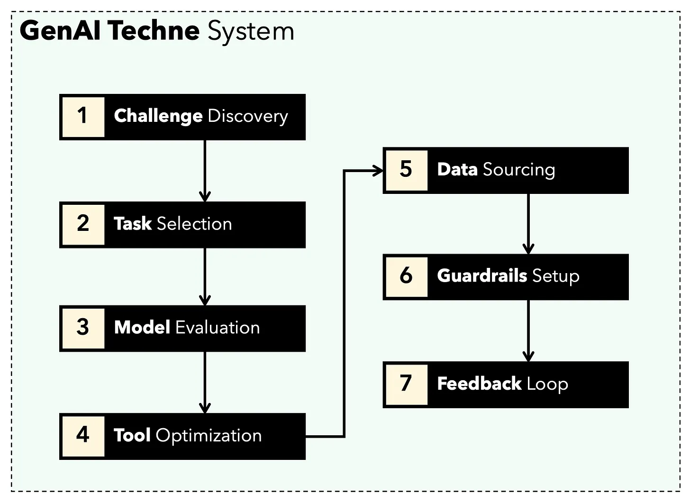

# GenAI Techne System (gtsystem)
*A low code Python package for crafting GenAI applications quickly*

GenAI Techne is on a mission to help enterprise and professionals excel in the craft of Generative AI. Check out the [GenAI Techne Substack](https://genaitechne.substack.com/) where you can read more about our mission, read gtsystem documentation, learn from step-by-step tutorials, and influence the roadmap of gtsystem for your use cases.

[](https://genaitechne.substack.com/)

## Getting Started

The get started using `gtsystem` package follow these steps.

**Step 1.** Install gtsystem package using `pip install gtsystem`

**Step 2.** Open a Jupyter notebook and try this sample.

```python
from gtsystem import openai, bedrock
prompt = 'How many faces does a tetrahedron have?'
openai.gpt_text(prompt)
bedrock.llama_text(prompt)
bedrock.claude_text(prompt)
```

## Features and Notebook Samples

You can read more about the vision behind gtsystem on the [GenAI Techne substack post](https://genaitechne.substack.com/p/excelling-in-the-craft-of-generative).

[](https://genaitechne.substack.com/p/excelling-in-the-craft-of-generative)

You can learn `gtsystem` API by following along the notebook samples included in this repo.

`01-evaluate.ipynb` for single statement prompt evaluations across multiple models including OpenAI GPT-4 and Bedrock hosted Claude 2.1 and Llama 2.

`02-render.ipynb` for well formatted rendering of the model responses.

`03-tasks.ipynb` for loading evaluation tasks - find, list, load prompts by task, including optinal parameter values for temperature and TopP.

`04-instrument.ipynb` for instrumenting and comparing multiple models across latency and size of response.

`05-benchmark.ipynb` for automating benchmarking the quality of responses from models like Llama and Claude using GPT-4 as an LLM evaluator.


## Amazon Bedrock Setup

To use [Amazon Bedrock](https://aws.amazon.com/bedrock/) hosted models like Llama and Claude follow these steps.

**Step 1.** Login to AWS Console > Launch Identity and Access Management (IAM) > Create a user for Command-Line Interface (CLI) access. 
*Read [Bedrock documentation](https://docs.aws.amazon.com/bedrock/latest/userguide/security-iam.html) for more details.*

**Step 2.** Install [AWS CLI](https://aws.amazon.com/cli/) > Run `aws configure` in Terminal > Add credentials from Step 1.

## Ollama Setup

To use Ollama provided LLMs locally on your laptop follow these steps.

**Step 1.** Download [Ollama](https://ollama.com/)
*Note the memory requirements for each model. 7b models generally require at least 8GB of RAM. 13b models generally require at least 16GB of RAM. 70b models generally require at least 64GB of RAM*

**Step 2.** Find model Ollama [library](https://ollama.com/library) > Run command in terminal to download and run model.
*Currently gtsystem supports popular models like llama2, mistral, and phi.*

## OpenAI Setup

To use OpenAI models follow these steps.

**Step 1.** Signup for [OpenAI API](https://openai.com/blog/openai-api) access and get the API key.

**Step 2.** Add OpenAI API Key to your `~/.zshrc` or `~/.bashrc` using `export OPENAI_API_KEY="your-key-here"`


